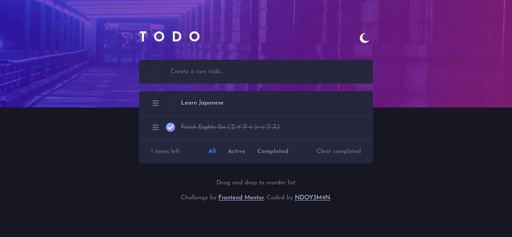

# Frontend Mentor - Todo app solution

This is a solution to the [Todo app challenge on Frontend Mentor](https://www.frontendmentor.io/challenges/todo-app-Su1_KokOW). Frontend Mentor challenges help you improve your coding skills by building realistic projects.

## Table of contents

- [Overview](#overview)
  - [The challenge](#the-challenge)
  - [Screenshot](#screenshot)
  - [Links](#links)
- [My process](#my-process)
  - [Built with](#built-with)
  - [Useful resources](#useful-resources)
- [Author](#author)

## Overview

### The challenge

Users should be able to:

- View the optimal layout for the app depending on their device's screen size
- See hover states for all interactive elements on the page
- Add new todos to the list
- Mark todos as complete
- Delete todos from the list
- Filter by all/active/complete todos
- Clear all completed todos
- Toggle light and dark mode
- **Bonus**: Drag and drop to reorder items on the list

### Screenshot

### Links

- Solution URL: [https://github.com/NDOY3M4N/todo-app](https://github.com/NDOY3M4N/todo-app)
- Live Site URL: [https://ndoy3m4n.github.io/todo-app/](https://ndoy3m4n.github.io/todo-app/)

## My process

### Built with

- Semantic HTML5 markup
- CSS custom properties
- Mobile-first workflow
- [Vue 3](https://v3.vuejs.org/) - JS library
- [Vue Draggable Next](https://vue-draggable-next.vercel.app/) - Vue 3 drag-and-drop component based on Sortable.js
- [Tailwind CSS](https://tailwindcss.com/) - A nice CSS Framework

### Useful resources

- [Theming Tailwind with CSS Variables](https://www.youtube.com/watch?v=MAtaT8BZEAo) - This video from **Tailwind Labs** helped me for implementing the dark/light theme.
- [Styling Form Elements with Tailwind CSS](https://www.youtube.com/watch?v=pONeWAzDsQg) - This video (also from Tailwind Labs) explains how to style a form element (in my case the checkbox input) using `@tailwindcss/forms` plugin.

## Author

- Frontend Mentor - [@NDOY3M4N](https://www.frontendmentor.io/profile/NDOY3M4N)
- Twitter - [@NDOY3M4N](https://www.twitter.com/NDOY3M4N)
